# Kanban de Dodo

Le Kanban de Dodo est un outil de type [Trello](https://trello.com/) permettant une gestion de projet(s).

- Lien vers l'application : [Kanban de Dodo](https://kanban-de-dodo.herokuapp.com/)

## Sommaire

- [Kanban de Dodo](#kanban-de-dodo)
  - [Sommaire](#sommaire)
  - [Origines du projet](#origines-du-projet)
  - [Technologies utilisées](#technologies-utilisées)
  - [Initialisation du projet en local](#initialisation-du-projet-en-local)
  - [Mode d'emploi de l'application](#mode-demploi-de-lapplication)
    - [Exemple d'utilisation](#exemple-dutilisation)
    - [Authentification / Inscription / Déconnexion](#authentification--inscription--déconnexion)
    - [Gestion des tableaux](#gestion-des-tableaux)
      - [Création de tableau](#création-de-tableau)
      - [Modification et suppression du tableau](#modification-et-suppression-du-tableau)
    - [Gestion des listes](#gestion-des-listes)
      - [Création de liste](#création-de-liste)
      - [Modification et suppression de liste](#modification-et-suppression-de-liste)
    - [Gestion des cartes](#gestion-des-cartes)
      - [Création de carte](#création-de-carte)
      - [Modification et suppression de carte](#modification-et-suppression-de-carte)
    - [Gestion des tags](#gestion-des-tags)
      - [Création de tag](#création-de-tag)
      - [Modification et suppression de tag](#modification-et-suppression-de-tag)
    - [Utilisation sur mobile / tablette](#utilisation-sur-mobile--tablette)

## Origines du projet

A la base, le Kanban était un projet de fin de socle à l'école [O'Clock](https://oclock.io/), celui-ci devait se décliner de la manière suivante :

- Une gestion mono-utilisateur
- Une création de listes et de cartes
- Puis nous étions libres d'y ajouter certaines features proposées par l'école

A partir de là, j'ai construit un nouvel [MCD](./docs/conception-bdd.md) prenant en compte plusieurs autres features :

- Une gestion de plusieurs utilisateurs avec inscription / authentification
- Une possibilité de créer plusieurs tableaux
- Création de listes, de cartes et de tags
- Ces diverses créations apportées ont toutes reçues des features permettant de les modifier à notre guise (gestion de la couleur de fond et du texte)
- Une gestion du drag & drop permettant de positionner les listes et cartes à notre guise

Le projet s'est donc découpé en deux phases, la première étant la construction de l'API Rest avec la gestion de la base de données en arrière-plan, la deuxième consistait à créer un front avec un framework CSS, le tout géré par du JavaScript permettant ainsi la communication avec l'API.

## Technologies utilisées

Outils utilisés en back (**langage JavaScript**) :

- [NodeJS](https://nodejs.org/)

- Packages NPM :
  - [Express](https://www.npmjs.com/package/express)
  - [Express-session](https://www.npmjs.com/package/express-session)
  - [Bcrypt](https://www.npmjs.com/package/bcrypt)
  - [Dotenv](https://www.npmjs.com/package/dotenv)
  - [Multer](https://www.npmjs.com/package/multer)
  - [Pg](https://www.npmjs.com/package/pg)
  - [Validator](https://www.npmjs.com/package/validator)
  
- [ORM Sequelize](https://sequelize.org/)
- [Base de données PostgreSQL](https://www.postgresql.org/)

Outils utilisés en front (**langages HTML / CSS / JavaScript**) :

- [Framework CSS Bulma](https://bulma.io/)
- Package NPM [SortableJS](https://www.npmjs.com/package/sortablejs)

## Initialisation du projet en local

L'application se trouve en ligne et est utilisable à ce lien : [Kanban de Dodo](https://kanban-de-dodo.herokuapp.com/).
Dans le cas où vous souhaiteriez la tester en local, voici la procédure à suivre :

1. Créer votre base de données sous PostgreSQL
    - Créer votre ROLE et votre DATABASE
    - Importer le fichier `create_tables.sql` dans votre base de donnéees qui généra les différentes tables de l'application
2. Créer votre fichier `.env` en suivant le `.env.example`
3. Installer tous les packages en utilisant la commande `npm install` dans votre terminal
4. Exécuter la commande `npm run start` pour lancer l'application
5. Lancer un navigateur puis entrer le lien `http://localhost:port` où port correspond à ce que vous avez indiqué dans votre `.env`

## Mode d'emploi de l'application

### Exemple d'utilisation

Comme déjà dit au début de ce README, le Kanban de Dodo est un outil de type [Trello](https://trello.com/) permettant une gestion de projet(s). En voici un exemple afin de vous montrer les possibilités de celui-ci. Ici, nous verrons une simple gestion des tâches ménagères :

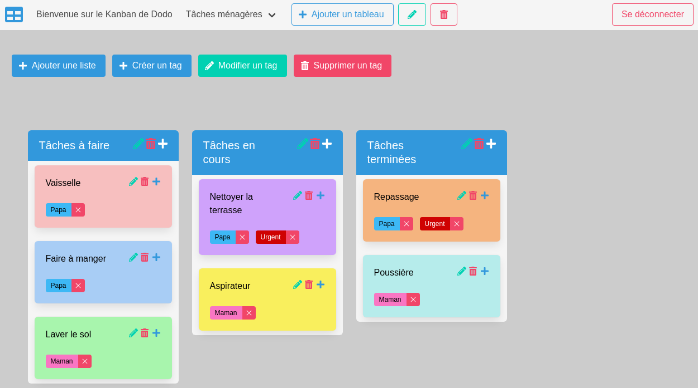

### Authentification / Inscription / Déconnexion

Lien de l'application : [Kanban de Dodo](https://kanban-de-dodo.herokuapp.com/).

Si c'est la première fois que vous arrivez sur l'application, la première chose à faire est de s'inscrire.

Pour se faire, cliquer sur le bouton "Créer un compte" qui se trouve en haut à droite de l'application.

Vous atterrissez donc sur le formulaire d'inscription, remplissez les champs demandés puis cliquez sur le bouton "Soumettre le formulaire". Si votre inscription se passe bien, vous vous retrouverez sur la page de connexion, autrement des erreurs apparaîtront sur la page d'inscription.

Une fois votre inscription faite, il ne vous reste plus qu'à vous connecter avec votre adresse email et votre mot de passe. Ainsi, vous arriverez sur l'application et vous n'aurez plus qu'à l'utiliser.

Un dernier point, si vous avez besoin de vous déconnecter, il suffit tout simplement d'appuyer sur le bouton "Se déconnecter" se trouvant en haut à droite de l'application.

### Gestion des tableaux

#### Création de tableau

Un tableau sera composé de plusieurs listes et cartes, chaque tableau étant indépendant l'un de l'autre. Vous pouvez donc créer autant de tableaux que vous aurez de projets à réaliser.

Tout d'abord, commençons par ajouter notre premier tableau ! Pour se faire, cliquer sur le bouton "Ajouter un tableau", une fenêtre va s'ouvrir. Vous aurez donc la possibilité de choisir le nom de votre tableau et sa couleur de fond. Une fois ces deux choix faits, il ne reste plus qu'à appuyer sur "Valider" pour confirmer.

Si vous êtes arrivés ici par une erreur de clique, pas de panique. Il suffit de cliquer sur la petite croix en haut à droite de la fenêtre ou bien de tout simplement "Annuler" !

Une fois la création terminée, vous êtes automatiquement redirigé vers le tableau et une liste de boutons apparaît.

#### Modification et suppression du tableau

Tout d'abord, penchons-nous sur les boutons permettant la modification du tableau et sa suppression.

Pour modifier un tableau, il suffit d'appuyer sur le "Crayon" juste à droite du bouton "Ajouter un tableau", celui-ci ouvrira une fenêtre dans laquelle vous pourrez modifier le nom et la couleur de fond du tableau actuel.

Enfin si vous souhaitez supprimer le tableau suite à une erreur de création ou bien parce que vous n'en avez plus l'utilité, il suffit de cliquer sur le bouton "Poubelle" qui supprimera **définitivement** le tableau actuel.

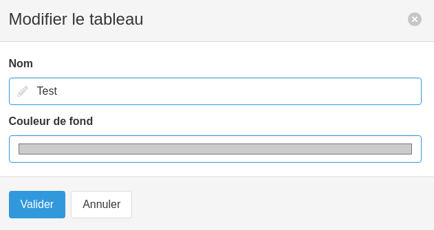

### Gestion des listes

#### Création de liste

Il est possible de créer plusieurs listes qui seront elles-mêmes composées de plusieurs cartes.

Tout d'abord, après avoir créé votre tableau, vous aurez accès à de nouveaux boutons, vous pouvez créer votre première liste en appuyant sur le bouton "Ajouter une liste". A partir de là, une fenêtre s'ouvrira, vous n'aurez plus qu'à choisir le nom de votre nouvelle liste et appuyer sur "Valider" pour confirmer votre choix. Vous pouvez créer autant de listes que vous le souhaitez.

De la même manière que sur les tableaux, si vous êtes arrivés ici par inadvertance, aucun souci il suffit de cliquer sur la petite croix en haut à droite de la fenêtre ou bien de tout simplement "Annuler".

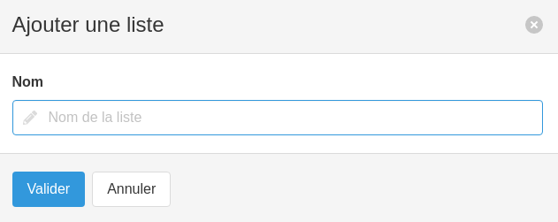

#### Modification et suppression de liste

Une fois votre liste créée, vous aurez accès à trois nouveaux boutons qui seront directement rattachés à cette dite liste.

Le premier bouton "Crayon" vous permettra de modifier le nom de la liste. Pour se faire cliquer dessus, une fenêtre s'ouvrira et vous aurez accès à un formulaire vous donnant la possibilité de modifier le nom de la liste actuellement sélectionnée.

Le deuxième bouton "Poubelle" vous permettra de supprimer **définitivement** la liste actuellement sélectionnée.

Le troisième bouton "+" vous permettra d'ajouter des cartes à cette liste, mais nous y reviendrons dessus plus tard.

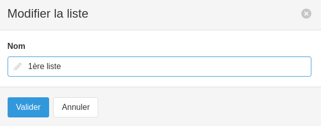

Dernière chose à savoir sur les listes, celles-ci peuvent être positionnées à votre guise. Pour se faire il suffit de cliquer sur le bloc d'une liste et de la déplacer au sein des autres listes.

### Gestion des cartes

#### Création de carte

Il est possible de créer plusieurs cartes au sein d'une liste.

Tout d'abord, vous pourrez ajouter des cartes au sein d'une liste en cliquant sur le bouton "+". Une fenêtre s'ouvrira vous offrant la possibilité de choisir le nom, la couleur de fond et la couleur de texte de votre carte. Pour confirmer votre choix, il ne reste plus qu'à appuyer sur le bouton "Valider". Vous pouvez créer autant de cartes que vous le souhaitez au sein d'une liste.

De la même manière que sur les autres créations, si vous êtes arrivés ici suite à une erreur, il vous suffit de cliquer la petite croix en haut à droite de la fenêtre ou bien de tout simplement "Annuler".

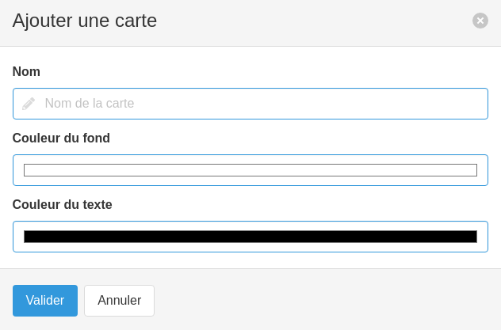

#### Modification et suppression de carte

Une fois votre carte créée, vous aurez accès à trois nouveaux boutons qui seront directement rattachés à cette dite carte.

Le premier bouton "Crayon" vous permettra de modifier les propriétés de la carte. Pour se faire cliquer dessus, une fenêtre s'ouvrira et vous aurez accès à un formulaire vous donnant la possibilité de modifier le nom, la couleur de fond et la couleur de texte de la carte actuellement sélectionnée.

Le deuxième bouton "Poubelle" vous permettra de supprimer **définitivement** la carte actuellement sélectionnée.

Le troisième bouton "+" vous permettra d'ajouter des tags à cette liste, mais nous y reviendrons dessus plus tard.

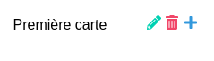

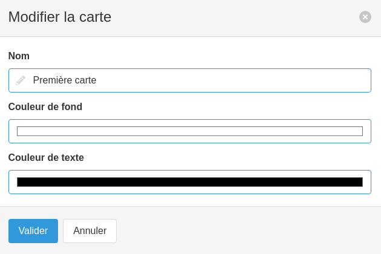

Dernière chose à savoir sur les cartes, celles-ci peuvent être glissées au sein d'une même liste mais aussi glissées dans une autre liste ! Pour se faire, cliquer sur la carte et déplacer là où bon vous semble.

### Gestion des tags

#### Création de tag

Il est possible de créer plusieurs tags qui pourront être rattachés à une ou plusieurs cartes dans les différents tableaux.

Pour créer un tag, rien de plus simple, appuyer sur le bouton "Créer un tag", une fenêtre s'ouvrira vous offrant la possibilité de choisir le nom, la couleur de fond et la couleur de texte du tag. Pour confirmer la création, il suffit d'appuyer sur le bouton "Valider".

Une fois votre tag créé, vous pourrez l'ajouter à n'importe quelle carte dans n'importe quel tableau !

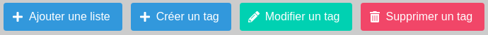

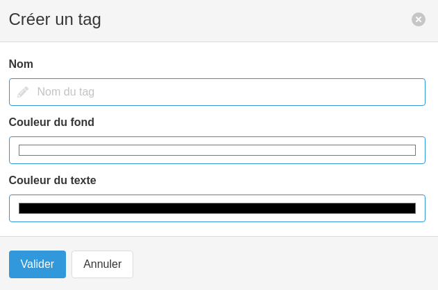

#### Modification et suppression de tag

Vous pouvez ajouter un tag à une carte en cliquant sur le bouton "+" de celle-ci. Une fenêtre apparaîtra vous donnant accès à la liste de tous les tags que vous aurez créé. Vous n'avez plus qu'à sélectionner le tag qui vous intéresse et appuyer sur le bouton "Valider" pour confirmer votre choix. Vous avez la possibilité d'ajouter **plusieurs tags** sur une seule et même carte.

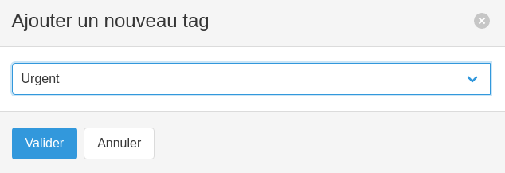

Pour modifier un tag existant, il vous suffit de cliquer sur le bouton "Modifier un tag" qui vous ouvrira une fenêtre. Dans celle-ci, vous aurez accès à une liste déroulante contenant tous les tags déjà créés. Vous n'avez plus qu'à sélectionner celui que vous souhaitez modifier et changer les champs qui vous intéresse. Une fois vos choix faits, il ne reste plus qu'à appuyer sur le bouton "Valider" pour confirmer votre choix.

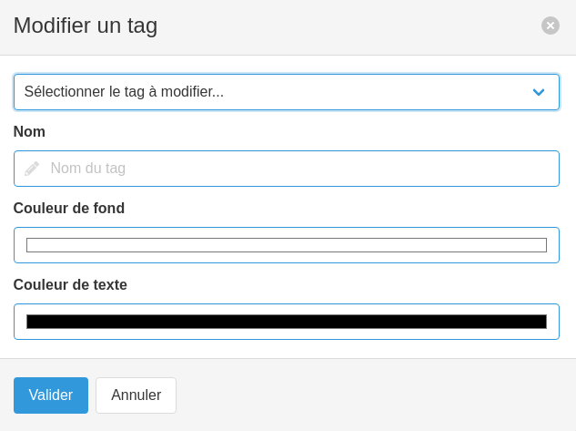

Vous pouvez supprimer un tag appartenant à une carte en appuyant sur la croix du dit tag. Cette suppression n'est pas définitive, elle ne fait que retirer le tag de la carte sélectionnée.

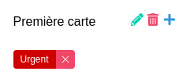

Si vous voulez supprimer **définitivement** un tag, il vous suffit de cliquer sur le bouton "Supprimer un tag". Une fenêtre apparaîtra vous donnant la possibilité de choisir le tag à supprimer via une liste déroulante. Il ne vous reste plus qu'à appuyer sur le bouton "Valider" pour confirmer votre choix. **Cela supprimera le dit tag sur toutes les cartes de tous les tableaux.**

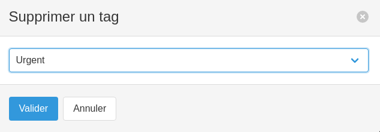

### Utilisation sur mobile / tablette

L'utilisation est identique sur mobile et tablette. La seule chose qui change vis-à-vis d'une version bureautique, c'est l'affichage :

- Sur tablette, nous sommes sur une lisibilité de trois listes
- Sur mobile, nous sommes sur une lisibilité d'une seule liste
- Sur tablette et mobile, le menu horizontal est remplacé par un menu de type "burger"

Pour afficher le menu, cliquer sur le menu burger (les trois barres horizontales) en haut à droite de votre écran. Cela affichera donc les diverses options que vous connaissez déjà. Enfin, pour fermer le menu, cliquer sur la croix présente en haut à droite de votre écran.

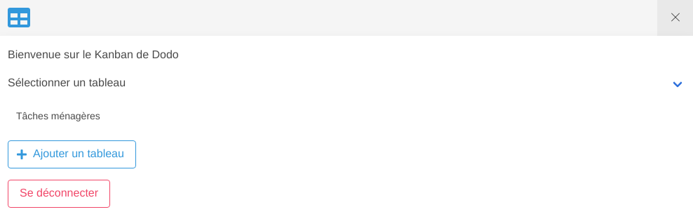
