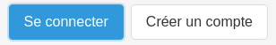
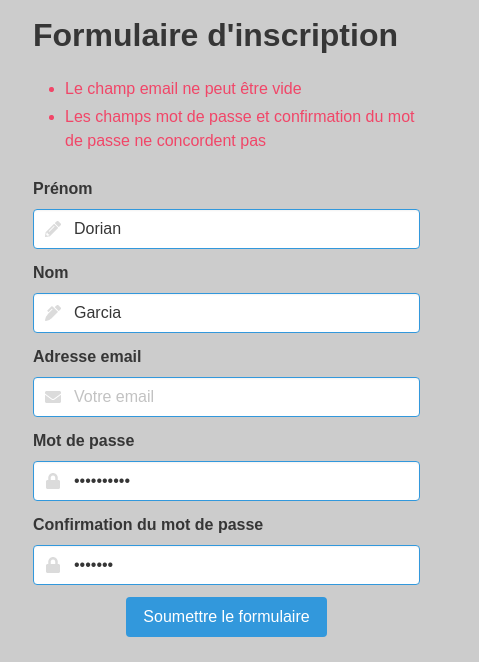
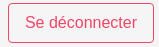
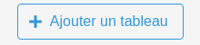
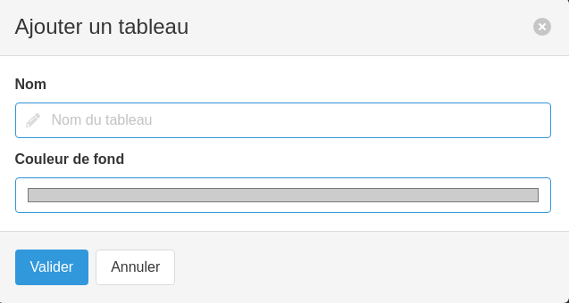
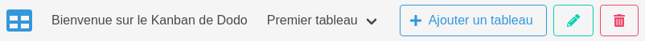

# Kanban de Dodo

Le Kanban de Dodo est un outil de type [Trello](https://trello.com/) permettant une gestion de projet(s).

- Lien vers l'application : [Kanban de Dodo](http://54.236.33.34/)

## Sommaire

- [Kanban de Dodo](#kanban-de-dodo)
  - [Sommaire](#sommaire)
  - [Origines du projet](#origines-du-projet)
  - [Technologies utilisées](#technologies-utilisées)
  - [Initialisation du projet en local](#initialisation-du-projet-en-local)
  - [Mode d'emploi de l'application](#mode-demploi-de-lapplication)
    - [Authentification / Inscription / Déconnexion](#authentification--inscription--déconnexion)
    - [Gestion des tableaux](#gestion-des-tableaux)
      - [Création de tableau](#création-de-tableau)
      - [Modification et suppression du tableau](#modification-et-suppression-du-tableau)
    - [Gestion des listes](#gestion-des-listes)
      - [Création de liste](#création-de-liste)
      - [Modification et suppression de liste](#modification-et-suppression-de-liste)
    - [Gestion des cartes](#gestion-des-cartes)
      - [Création de carte](#création-de-carte)
      - [Modification et suppression de carte](#modification-et-suppression-de-carte)
    - [Gestion des tags](#gestion-des-tags)
      - [Création de tag](#création-de-tag)
      - [Modification et suppression de tag](#modification-et-suppression-de-tag)
    - [Utilisation sur mobile / tablette](#utilisation-sur-mobile--tablette)

## Origines du projet

A la base, le Kanban était un projet de fin de socle à l'école [O'Clock](https://oclock.io/), celui-ci devait se décliner de la manière suivante :

- Une gestion mono-utilisateur
- Une création de listes et de cartes
- Puis nous étions libres d'y ajouter certaines features proposées par l'école

A partir de là, j'ai construit un nouvel [MCD](./docs/conception-bdd.md) prenant en compte plusieurs autres features :

- Une gestion de plusieurs utilisateurs avec inscription / authentification
- Une possibilité de créer plusieurs tableaux
- Création de listes, de cartes et de tags
- Ces diverses créations apportées ont toutes reçues des features permettant de les modifier à notre guise (gestion de la couleur de fond et du texte)
- Une gestion du drag & drop permettant de positionner les listes et cartes à notre guise

Le projet s'est donc découpé en deux phases, la première étant la construction de l'API Rest avec la gestion de la base de données en arrière-plan, la deuxième consistait à créer un front avec un framework CSS, le tout géré par du JavaScript permettant ainsi la communication avec l'API.

## Technologies utilisées

Outils utilisés en back (**langage JavaScript**) :

- [NodeJS](https://nodejs.org/)

- Packages NPM :
  - [Express](https://www.npmjs.com/package/express)
  - [Express-session](https://www.npmjs.com/package/express-session)
  - [Bcrypt](https://www.npmjs.com/package/bcrypt)
  - [Dotenv](https://www.npmjs.com/package/dotenv)
  - [Multer](https://www.npmjs.com/package/multer)
  - [Pg](https://www.npmjs.com/package/pg)
  - [Validator](https://www.npmjs.com/package/validator)
  
- [ORM Sequelize](https://sequelize.org/)
- [Base de données PostgreSQL](https://www.postgresql.org/)

Outils utilisés en front (**langages HTML / CSS / JavaScript**) :

- [Framework CSS Bulma](https://bulma.io/)
- Package NPM [SortableJS](https://www.npmjs.com/package/sortablejs)

## Initialisation du projet en local

L'application se trouve en ligne et est utilisable à ce lien : [Kanban de Dodo](http://54.236.33.34/).
Dans le cas où vous souhaiteriez la tester en local, voici la procédure à suivre :

1. Créer votre base de données sous PostgreSQL
    - Créer votre ROLE et votre DATABASE
    - Importer le fichier `create_tables.sql` dans votre base de donnéees qui généra les différentes tables de l'application
2. Créer votre fichier `.env` en suivant le `.env.example`
3. Installer tous les packages en utilisant la commande `npm install` dans votre terminal
4. Exécuter la commande `npm run start` pour lancer l'application
5. Lancer un navigateur puis entrer le lien `http://localhost:port` avec le port qui correspond à ce que vous avez indiqué dans votre `.env`

## Mode d'emploi de l'application

### Authentification / Inscription / Déconnexion

Lien de l'application : [Kanban de Dodo](http://54.236.33.34/).

Si c'est la première fois que vous arrivez sur l'application, la première chose à faire est de s'inscrire.

Pour se faire, cliquer sur le bouton "Créer un compte" qui se trouve en haut à droite de l'application.

Vous atterrissez donc sur le formulaire d'inscription, remplissez les champs demandés puis cliquez sur le bouton "Soumettre le formulaire". Si votre inscription se passe bien, vous vous retrouverez sur la page de connexion, autrement des erreurs apparaîtront sur la page d'inscription.

Une fois votre inscription faite, il ne vous reste plus qu'à vous connecter avec votre adresse email et votre mot de passe. Ainsi, vous arriverez sur l'application et vous n'aurez plus qu'à l'utiliser.

Un dernier point, si vous avez besoin de vous déconnecter, il suffit tout simplement d'appuyer sur le bouton "Se déconnecter" se trouvant en haut à droite de l'application.

### Gestion des tableaux

#### Création de tableau

Un tableau sera composé de plusieurs listes et cartes, chaque tableau étant indépendant l'un de l'autre. Vous pouvez donc créer autant de tableaux que vous aurez de projets à réaliser.

Tout d'abord, commençons par ajouter notre premier tableau ! Pour se faire, cliquer sur le bouton "Ajouter un tableau", une fenêtre va s'ouvrir. Vous aurez donc la possibilité de choisir le nom de votre tableau et sa couleur de fond. Une fois ces deux choix faits, il ne reste plus qu'à appuyer sur "Valider".

Si vous êtes arrivés ici par une erreur de clique, pas de panique. Il suffit de cliquer sur la petite croix en haut à droite de la fenêtre ou bien de tout simplement "Annuler" !

Une fois la création terminée, vous êtes automatiquement redirigé vers le tableau et une liste de boutons apparaît.

#### Modification et suppression du tableau

Tout d'abord, penchons-nous sur les boutons permettant la modification du tableau et sa suppression.

Pour modifier un tableau, il suffit d'appuyer sur le "Crayon" juste à droite du bouton "Ajouter un tableau", celui-ci ouvrira une fenêtre dans laquelle vous pourrez modifier le nom et la couleur de fond du tableau actuel.

Enfin si vous souhaitez supprimer le tableau suite à une erreur de création ou bien parce que vous n'en avez plus l'utilité, il suffit de cliquer sur le bouton "Poubelle" qui supprimera **définitivement** le tableau actuel.

### Gestion des listes

#### Création de liste

Section à venir...

#### Modification et suppression de liste

Section à venir...

### Gestion des cartes

#### Création de carte

Section à venir...

#### Modification et suppression de carte

Section à venir...

### Gestion des tags

#### Création de tag

Section à venir...

#### Modification et suppression de tag

Section à venir...

### Utilisation sur mobile / tablette

Section à venir...
